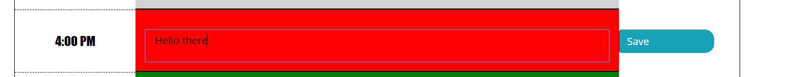
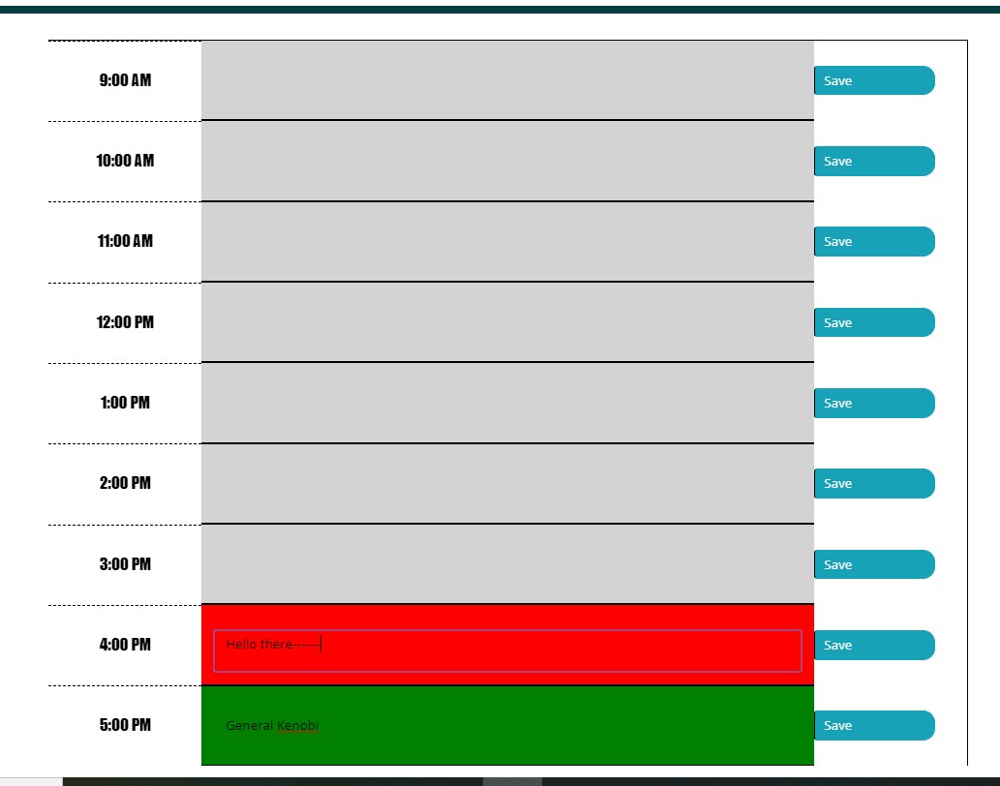

# Work Day Scheduler 

## Organize your workday!

### Current time highlighted in red!

Format: 

#### Set tasks ahead of time highlighted in green! 

Format: 

#### Color coded by past, present, furture!

Format: 

#### Current date displayed at the top! 

Format: 

#### Link to IO

[TEXT TO SHOW](andytheelf.github.io)
